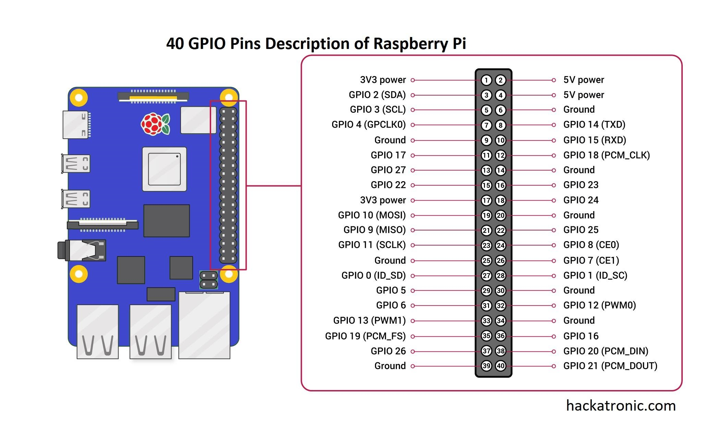
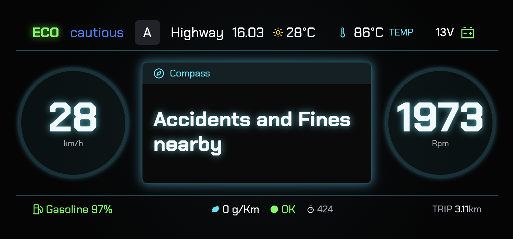

# 🚘 Multi-Agent TinyML & Small Language Model Architecture for Intelligent Vehicle Monitoring

<p align="center">
  
</p>  


---

## 🧠 Overview

This repository implements a **multi-agent embedded architecture** that combines **TinyML algorithms**, **sensor fusion**, and **Small Language Models (SLMs)** for **on-board vehicle monitoring**.  

The system runs locally on a **Raspberry Pi 5**, collecting real-time data via **OBD-II**, **GPS**, and **accelerometer**, and then processing it through four cooperative agents:

| Agent | Role |
|-------|------|
| **Behavior Agent** | Classifies the driver’s behavior (Cautious, Normal, Aggressive) using the **MMCloud** incremental clustering algorithm. |
| **Safety Agent** | Checks for **accident and fine records** near the vehicle based on the **Brazilian Federal Highway Police (PRF)** dataset (2019-2024). |
| **Policy Engine** | Merges the outputs from all agents into a unified driving state and risk level. |
| **Advise Agent (LLM)** | Generates short, natural-language advice combining driver behavior, road context, and nearby events (e.g., *“You are driving aggressively in an accident-prone area, please slow down.”*). |

All messages are logged incrementally, with full system metrics (CPU, memory, inference times) stored in **dynamic trip logs**.

---

## 📂 Repository Structure

| File | Description |
|------|--------------|
| `websocket_obd.py` | Main WebSocket app for orchestrating data flow between agents and UI. |
| `advise_agent.py` | LLM-based agent that refines contextual feedback to the driver. |
| `behavior_agent.py` | Driver behavior detection using MMCloud clustering. |
| `safety_agent.py` | Identifies accident or fine zones using PRF spatial data. |
| `policy_engine.py` | Fuses all agent outputs to define the global driving policy. |
| `llm_runtime_openai.py` | Lightweight wrapper for local OpenAI-style inference (e.g., llama.cpp, Ollama). |
| `trip_log.py` | Dynamic CSV logging with evolving headers (auto-backfill for LLM results). |
| `gps.py`, `accelerometer.py`, `consumption.py`, `emissions.py` | Sensor data modules. |
| `start_app.sh` | Shell script to launch the system. |
| `models/` | Pretrained models (RandomForest for fuel and road type, KAN/TEDA models, etc.). |
| `acidentes_processado.csv`, `multas_processado.csv` | PRF datasets for accident/fine lookup. |

---

## ⚙️ System Features

- **Real-time sensor fusion:** OBD-II + GPS + accelerometer + external datasets.  
- **On-device learning:** Incremental clustering and anomaly detection (MMCloud, TEDA).  
- **Local interpretability:** Small language model generates concise driver feedback.  
- **Dynamic trip logs:** Each trip produces a timestamped CSV (`trip_YYYY-MM-DD_HH-MM-SS.csv`).  
- **Low latency:** Entire pipeline runs on-board without cloud dependence.  
- **Edge metrics:** Records CPU, RAM, and latency per inference module.  

---

## 🚀 Running the Project

### 1️⃣ Clone and install dependencies

```bash
git clone https://github.com/conect2ai/mmcloud-agent-development.git
cd mmcloud-agent-development
pip install -r requirements.txt
```

### 2️⃣ Download the SLM model

If you want to enable the Advise Agent with a local LLM, download the quantized Qwen model:

```bash
https://huggingface.co/Qwen/Qwen2.5-0.5B-Instruct-GGUF
```

Then place the `.gguf` file in the `models/` folder. Specifically, we are using the `qwen2.5-0.5b-instruct-q4_k_m.gguf` version.

---

### 3️⃣ Running on Raspberry Pi 5

**Hardware:**
- Raspberry Pi 5 (8 GB RAM, 64–128 GB microSD)
- GPS GT-U7 via UART
- MPU6050 accelerometer via I²C
- Bluetooth OBD-II adapter (ELM327 or compatible)

---

#### 🔌 Hardware Connections

| Module | Pinout |
|---------|--------|
| **MPU6050 (I²C)** | VCC → 3.3V/5V, GND → GND, SDA → GPIO 2 (pin 3), SCL → GPIO 3 (pin 5) |
| **GPS GT-U7 (UART)** | VCC → 3.3V/5V, GND → GND, TX → GPIO 15 (RXD), RX → GPIO 14 (TXD) |
| **OBD-II (Bluetooth)** | Pair and map as `/dev/rfcomm0` |

<p align="center">
  
</p>

---

#### 🧭 Raspberry Pi Setup

**Enable I2C (for the MPU6050)**
Run:

```bash
sudo raspi-config
```

Navigate to:

```
3 – Interface Options → I4 I2C → Yes
```

**Enable UART (for the GT-U7 GPS)**
Still in `raspi-config`:

```
3 – Interface Options → I6 Serial Port →
Would you like a login shell to be accessible over serial? → No
Would you like the serial port hardware to be enabled? → Yes
```

Install dependencies:
```bash
sudo apt update && sudo apt install pps-tools gpsd gpsd-clients chrony i2c-tools python3-smbus
```

Add to `/boot/firmware/config.txt`:
```bash
dtoverlay=pps-gpio,gpiopin=18
enable_uart=1
init_uart_baud=9600
```

Then add to `/etc/modules`:
```
pps-gpio
```

Reboot:
```bash
sudo reboot
```

---

#### 🛰️ Test GPS (optional)

```bash
sudo systemctl stop gpsd gpsd.socket
sudo gpsd /dev/ttyAMA0 -F /var/run/gpsd.sock
cgps -s
```

---

#### 🔧 Connect Bluetooth OBD-II

```bash
bluetoothctl
power on
agent on
scan on
pair 00:1D:A5:68:98:8B
connect 00:1D:A5:68:98:8B
trust 00:1D:A5:68:98:8B
exit

sudo rfcomm bind /dev/rfcomm0 00:1D:A5:68:98:8B
```

Test:
```bash
minicom -b 38400 -o -D /dev/rfcomm0
```

---

### 4️⃣ Run the Application

```bash
bash start_app.sh
```
---

## 🧩 Example of Multi-Agent Feedback

| Context | LLM Output |
|----------|-------------|
| Aggressive driving + accident zone | “You are driving aggressively in an area with accident history. Please be more careful.” |
| Cautious driving + safe zone | “Your driving behavior is cautious — good for fuel efficiency.” |
| Normal driving + fine zone | “There are speed fines nearby. Maintain speed limits.” |

<p align="center">
  
</p>  

---

## 📜 License

This project is released under the **MIT License**.  
See [LICENSE](LICENSE) for details.

---

## 🌎 About the Conect2AI Group

The [**Conect2AI**](http://conect2ai.dca.ufrn.br) research group is composed of undergraduate and graduate students from the Federal University of Rio Grande do Norte (UFRN). Our mission is to apply Artificial Intelligence (AI) and Machine Learning in emerging areas.

### 🎯 Our areas of focus include:

- **Embedded Intelligence and IoT**: Optimizing resource management and energy efficiency for connected environments.
- **Energy Transition and Mobility**: Using AI to optimize the energy consumption of connected vehicles and promote more efficient and sustainable mobility.